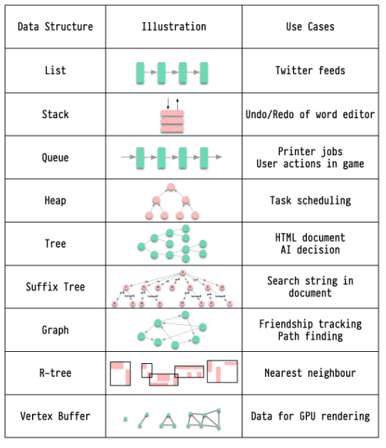

# Data Structure

## What are the data structures used in daily life?

A good engineer needs to recognize how data structures are used in our daily lives.

    * list: keep your Twitter feeds
    * stack: support undo/redo of the word editor
    * queue: keep printer jobs, or send user actions in-game
    * heap: task scheduling
    * tree: keep the HTML document, or for AI decision
    * suffix tree: for searching string in a document
    * graph: for tracking friendship, or path finding
    * r-tree: for finding the nearest neighbor
    * vertex buffer: for sending data to GPU for rendering

To conclude, data structures play an important role in our daily lives, both in our technology and in our experiences.
Engineers should be aware of these data structures and their use cases to create effective and efficient solutions.
