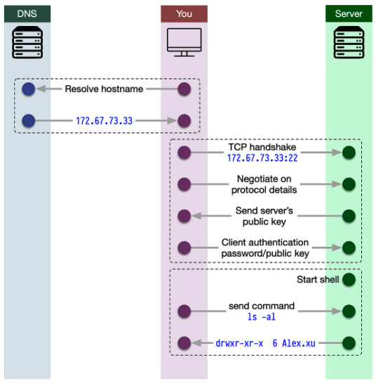

# SSH

In the 1990s, Secure Shell was developed to provide a secure alternative to Telnet for remote system access and management.
Using SSH is a great way to set up secure communication between client and server because it uses a secure protocol.

## What happens when you type "ssh hostname"?

The following happens when you type "ssh hostname":

    * Hostname resolution: Convert the hostname to an IP address using DNS or the local hosts file.
    * SSH client initialization: Connect to the remote SSH server.
    * TCP handshake: Establish a reliable connection.
    * Protocol negotiation: Agree on the SSH protocol version and encryption algorithms.
    * Key exchange: Generate a shared secret key securely.
    * Server authentication: Verify the server's public key.
    * User authentication: Authenticate using a password, public key, or another method.
    * Session establishment: Create an encrypted SSH session and access the remote system.
