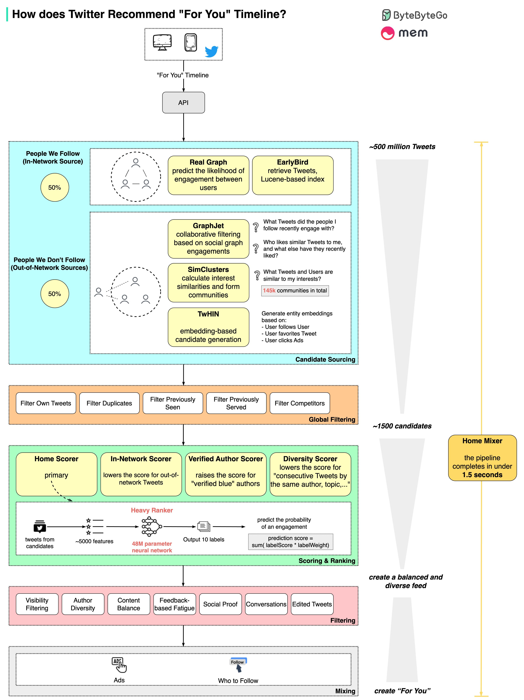

# Twitter's Timeline Recommendation System

In February 2023, Elon Musk decided to open-sourced the core ML algorithms of the Twitter.
Due to this decision, we could understand the core business logic of how Twitter recommends timeline "for you" within few seconds.

Below are links for Open-sourced ML algorithm repos.

- [the-algorithm](https://github.com/twitter/the-algorithm)
- [the-algorithm-ml](https://github.com/twitter/the-algorithm-ml)

## Pipeline Overview

The diagram below shows the detailed pipeline based on the open-sourced algorithm.

The process involves 5 stages:

    * Candidate Sourcing: start with 500 million Tweets
    * Global Filtering: down to 1500 candidates
    * Scoring & Ranking: 48M parameter neural network, Twitter Blue boost
    * Filtering: to achieve author and content diversity
    * Mixing: with Ads recommendation and Who to Follow
