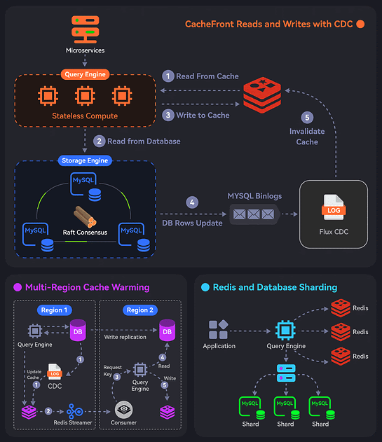

# How Uber Served 40 Million Reads with Integrated Redis Cache?

There are 3 main parts of the implementation:

## 1. CacheFront Read and Writes with CDC

- Uber built CacheFront - an integrated caching solution with Redis, Docstore, and MySQL.
- Rather than the microservice, Docstore’s query engine communicates with Redis for read requests.
- For cache hits, the query engine fetches data from Redis. For cache misses, the request goes to the storage engine and the database.
- In the case of writes, Docstore’s CDC service (Flux) invalidates the records in Redis. It tails MySQL binlog events to trigger the invalidation.

## Multi-Region Cache Warming with Redis Streaming

- A region fail-over can result in cache misses and overload the database.
- To handle this, Uber’s engineering team uses cross-region Redis replication. This is done by tailing the Redis write stream to replicate keys to the remote region.
- In the remote region, the stream consumer issues read requests to the query engine that reads the database and updates the cache.

## Redis and Docstore Sharding

- All teams in Uber use Docstore and some generate a huge number of requests.
- Both Redis and Docstore instances are sharded or partitioned to handle the load. But a single Redis cluster going down may create a hot DB shard.
- To prevent this, they partitioned the Redis cluster using a scheme that was different from the DB sharding. This ensures that the load is evenly distributed.
