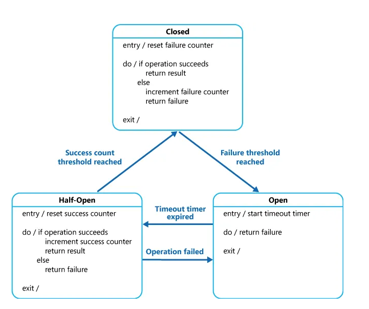

# Circuit Breaker Pattern

Michael Nygard’s book, [Release It!](https://pragprog.com/titles/mnee2/release-it-second-edition/), popularized the Circuit Breaker pattern, which can prevent an application from continually attempting to execute an action that is likely to fail, allowing it to proceed without waiting for the problem to be corrected or spending CPU cycles while determining the fault’s duration.

The Circuit Breaker pattern also allows an application to determine whether or not the issue has been remedied.
If the problem appears to be resolved, the program can attempt to perform the operation.

The Circuit Breaker pattern serves a distinct purpose than the Retry pattern.
The Retry pattern allows an application to retry an operation in the hope that it will succeed the next time.

The Circuit Breaker design prohibits an application from doing a risky activity.
An application can use the Retry pattern to trigger an action through a circuit breaker to combine these two patterns.
The retry logic, on the other hand, should be alert to any exceptions supplied by the circuit breaker and should cease repeat attempts if the circuit breaker indicates that a fault is not temporary.

