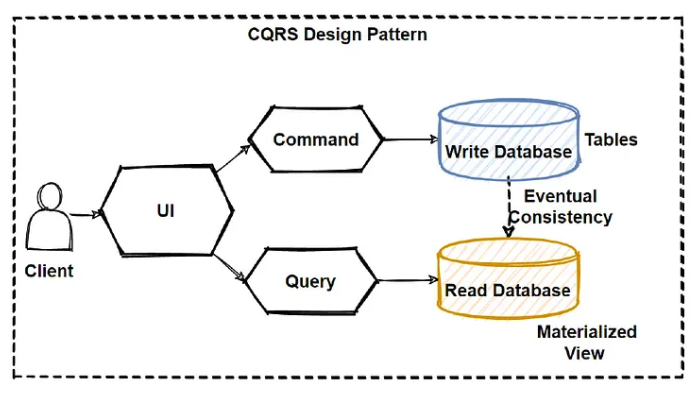

# CQRS Pattern

CQRS stands for Command and Query Responsibility Segregation, a pattern that isolates data store read and update processes.
CQRS implementation in your application can improve its performance, scalability, and security.
The flexibility gained by moving to CQRS enables a system to evolve more effectively over time and prevents update instructions from triggering merge conflicts at the domain level.

Separate query and update models make design and implementation easier.
Although, CQRS code cannot be automatically generated from a database schema using scaffolding techniques such as ORM tools (although, you can add your customised on top of the generated code).

You can physically split the read and write data for more isolation. In that instance, the read database can utilise its own query-optimized data schema.
It can, for example, store a materialised view of the data to avoid complex joins or ORM mappings.
It may even employ a different sort of data storage.
For example, the write database could be relational, and the read database could be a document database.
