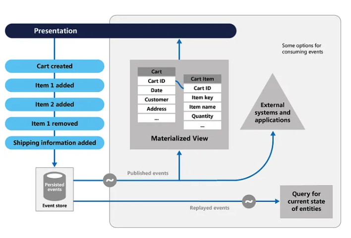

# Event Sourcing Pattern

Most apps operate with data, and the common method is for the program to keep the data in its present state by updating it when users interact with it.
In the classic create, read, update, and delete (CRUD) architecture, for example, a typical data operation is to receive data from the store, make some changes to it, and then update the current state of the data with the new values— often by utilizing transactions that lock the data.

The Event Sourcing design defines a method for handling data activities that are triggered by a series of events, each of which is recorded in an append-only store.
Application code delivers a series of events to the event store, where they are persisted, that must describe each action that has occurred on the data.
Each event describes a collection of data changes (for example, "AddedItemToOrder").

The events are saved in an event store, which serves as the system of record (the official data source) for the data’s present state.
These events are often published by the event retailer so that consumers are aware and can handle them if necessary.
Consumers may, for example, start tasks that apply the operations in the events to other systems, or they could execute any other associated action required to finish the process.
It’s worth noting that the application code that generates the events is separate from the systems that subscribe to them.
