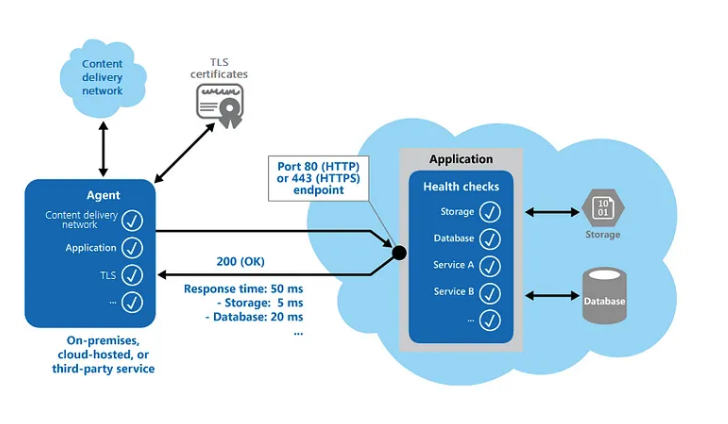

# Health Endpoint Monitoring Pattern

The Health Endpoint Monitoring pattern can be used to ensure that programmes and services are operating properly.
This pattern outlines how functional checks should be used in an application.
Through open endpoints, external tools have regular access to these checks.

Sending requests to an endpoint on your application will enable health monitoring.
After running all essential tests, the programme should indicate its state.

Usually, a health monitoring check combines two elements:

    - When a request is made to a health verification endpoint, the application or service executes checks, if any.
    - The evaluation of the outcomes by the system or tool that conducts the health verification check
    - The response code indicates the application’s status. The status of the app’s components and services may optionally be provided in the response code. The latency or reaction time check is carried out by the monitoring tool or framework.

