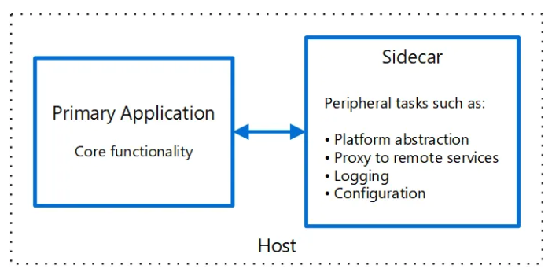

# Sidecar Pattern

Monitoring, logging, configuration, and networking services are frequently required by applications and services.
These extraneous chores might be carried out as distinct components or services.

A sidecar service is not always part of the application, but it is linked to it.
It follows the parent application everywhere it goes. Sidecars are procedures or services that are delivered alongside the principal application.
The sidecar on a motorbike is coupled to one motorcycle, and each motorcycle can have its own sidecar.
A sidecar service, similarly, mirrors the fate of its parent application.
A sidecar instance is deployed and hosted alongside each instance of the application.

They can execute in the same process as the application if they are tightly integrated, making optimal use of shared resources.
This, however, implies that they are not properly separated, and a failure in one of these components can affect other components or the entire application.
Furthermore, they must normally be written in the same language as the parent program.
As a result, the component and the application are highly dependent on one another.

## Differences between Sidecar and Ambassador and Adapter pattern

1. Sidecar pattern: An extra container in your pod to enhance or extend the functionality of the main container.

2. Ambassador pattern: A container that proxy the network connection to the main container.

3. Adapter pattern: A container that transform output of the main container.

### Summary - Actually all patterns proxy the connection

In the patterns above, both Ambassador and Adapter must in fact proxy the network connection, but do it with different purpose.
With Istio, this is done e.g. to terminate mTLS connection, collect metrics and more to enhance your main container.
So it actually is a sidecar pattern but confusingly, as you correctly pointed out, all pattern proxy the connection - but for different purposes.

## References

- [StackOverflow: Differences between Sidecar and Ambassador and Adapter pattern](https://stackoverflow.com/questions/59451056/differences-between-sidecar-and-ambassador-and-adapter-pattern)
