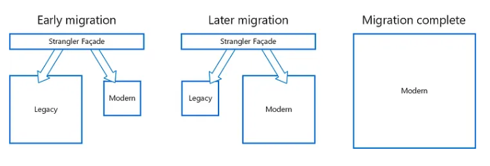

# Strangler Fig

Migrate a legacy system incrementally by gradually replacing certain functionalities with new apps and services.
The old system is eventually choked by the new system, which eventually replaces all of the features of the legacy system, enabling you to decommission it.

Replace specific functionalities in stages with fresh software and services.
Make a façade that catches requests headed for the legacy backend system.
These requests are forwarded by the façade to either the new services or the legacy application.
Customers can use the same interface while existing functionality are progressively moved to the new system, completely ignorant of the transition.

This method helps spread out the development work across time and reduce migration risk.
You may add functionality to the new system at any rate you like while ensuring the legacy application continues to work because the façade safely directs users to the appropriate application.
The legacy system gradually becomes “strangled” and is no longer required over time as features are transferred to the new system.
After finishing this procedure, the legacy system can be safely retired.
